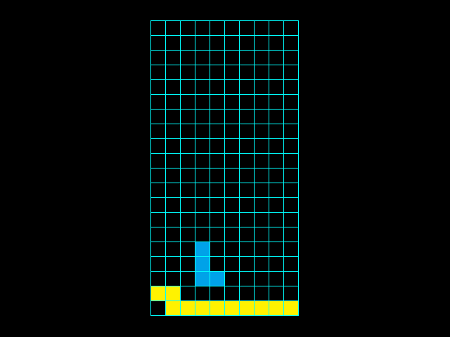

# FPGA Tetris
This repository contains a Tetris implemented in verilog for the Nexys 2 FPGA board.
Contributors: kwakobo, mihyunan

## Features
* Video output via VGA port (640x480)
* Onboard debounced push button inputs
* Pseudorandom Tetris block generation

## Screenshot

